# GPaiements

**GPaiements** est une plateforme web PHP permettant de gérer facilement les activités, les acteurs et les paiements associés. Elle s’adresse aux organisateurs d’événements, responsables administratifs ou à toute structure ayant besoin de suivre et d’automatiser la gestion des paiements.

---

## 🚀 Fonctionnalités principales

- **Création et gestion des activités** : Ajoutez, modifiez et supprimez des activités.
    * Chaque activité peut contenir des informations détaillées (nom, description, période, centre, note génératrice, timbre, titres associés, différents responsables et leurs titres, etc.).
    * Plusieurs types d'activités sont disponibles :
      - **Activité de type 1** : En plus des informations ci-dessus, elle prend en compte le taux journalier.
      - **Activité de type 2** : Ce type d'activité, en plus du taux journalier, associe à chaque titre une indemnité forfaitaire.
      - **Activité de type 3** : Ce type d'activité exclut le taux journalier, mais prend en compte le taux par tâche, les frais de déplacement journaliers et associe à chaque titre une indemnité forfaitaire.

- **Gestion des participants** : Ajoutez des participants, renseignez leurs informations et associez-les à des activités. Vous avez également la possibilité d'ajouter des comptes bancaires aux participants (jusqu'à 3 comptes bancaires par participant).
- **Authentification sécurisée** : Accès protégé par compte utilisateur.
- **Export des données** : Génération de documents PDF (états de paiement, ordres de virement, attestations, notes de service, liste des Relevés d'Identité Bancaire (RIB) des participants, etc.).
- **Gestion des rôles et titres** : Attribuez des rôles/titres aux acteurs selon l’activité.

---

## 🔧 Prérequis

- PHP 8.1 ou supérieur
- MySQL / MariaDB
- Apache ou Nginx
- Extensions PHP : `pdo`, `mbstring`, `intl`, `zip`
- XAMPP

---

## ⚙️ Installation sous Windows

### 1. Télécharger XAMPP

- Rendez-vous sur le site officiel :
  [https://www.apachefriends.org/fr/index.html](https://www.apachefriends.org/fr/index.html)
- Cliquez sur “Télécharger” pour la version Windows.
- Une fois le fichier téléchargé (`xampp-windows-x64-xx.x.x-x-installer.exe`),
  double-cliquez dessus pour lancer l’installation.

### 2. Installer XAMPP

- Lors de l’installation, laissez les options par défaut (Apache, MySQL, PHP,
  phpMyAdmin, etc.).
- Choisissez le dossier d’installation (par défaut : `C:\xampp`).
- Terminez l’installation et lancez le panneau de contrôle XAMPP.
- Laissez les paramètres de XAMPP par défaut.

### 3. Démarrer les services nécessaires

- Ouvrez le panneau de contrôle XAMPP (`xampp-control.exe`).
- Cliquez sur “Start” pour **Apache** et **MySQL**.
- Vérifiez que les deux services sont bien en vert.

### 4. Télécharger le projet

- Téléchargez le projet depuis le dépôt GitHub : [https://github.com/Espero007/gestion_paiements.git](https://github.com/Espero007/gestion_paiements.git)

### 5. Lancer le serveur interne PHP

- Ouvrez une invite de commandes (cmd) ou PowerShell.
- Placez-vous dans le dossier dézippé du projet :
  ```bash
  cd C:\chemin_vers_votre_dossier\
  ```
- Lancez le serveur interne PHP sur le port de votre choix (veillez à ce que ce port ne soit pas occupé par une autre application, par exemple : 8000) :
  ```bash
  php -S localhost:port
  ```
- L’application sera accessible à l’adresse [http://localhost:port](http://localhost:port)
   - Exemple : Pour le port 8000, accédez à l'application via [http://localhost:8000](http://localhost:8000)

### 6. Configurez votre navigateur

1. Allez dans les paramètres de votre navigateur.
2. Rendez-vous dans la section Téléchargements.
3. Cochez l'option : `Toujours demander où enregistrer les fichiers`.

---

## 📝 Guide d’utilisation

### 1. Création de compte et connexion

- Une fois que vous avez accédé à la page, commencez par créer un compte en entrant vos informations.

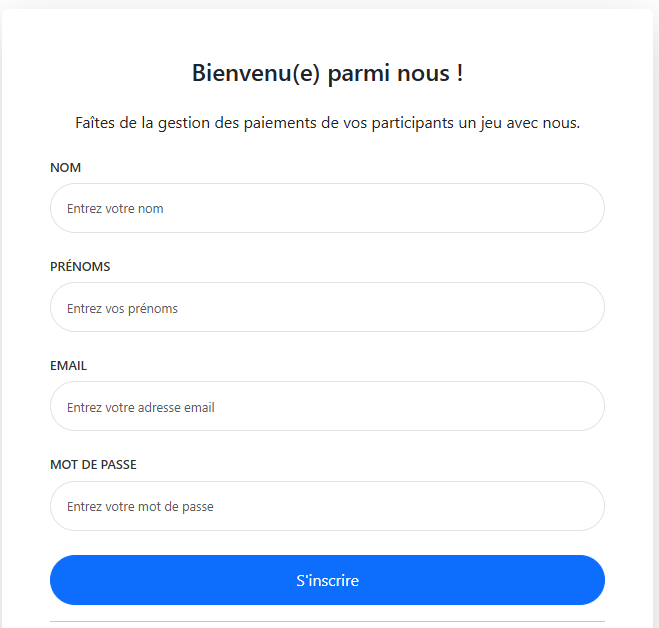

- Ensuite, vous recevrez un email de confirmation qui vous redirigera directement vers le tableau de bord comme ci-dessous :

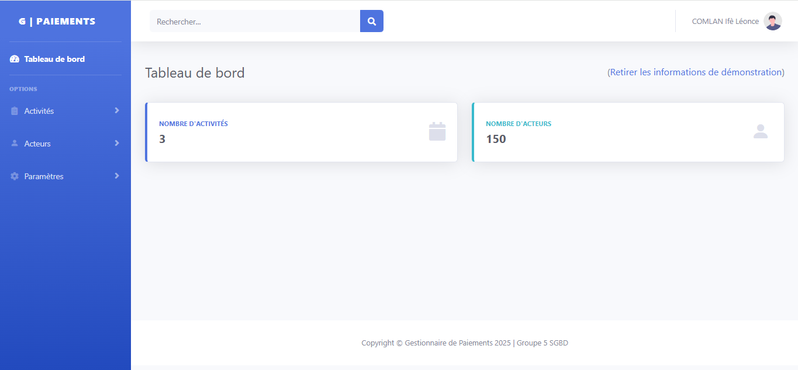

- Si vous avez déjà un compte, connectez-vous directement avec vos identifiants (vous pouvez cliquer sur le bouton `Se souvenir de moi` pour ne plus avoir à entrer vos identifiants à chaque fois).

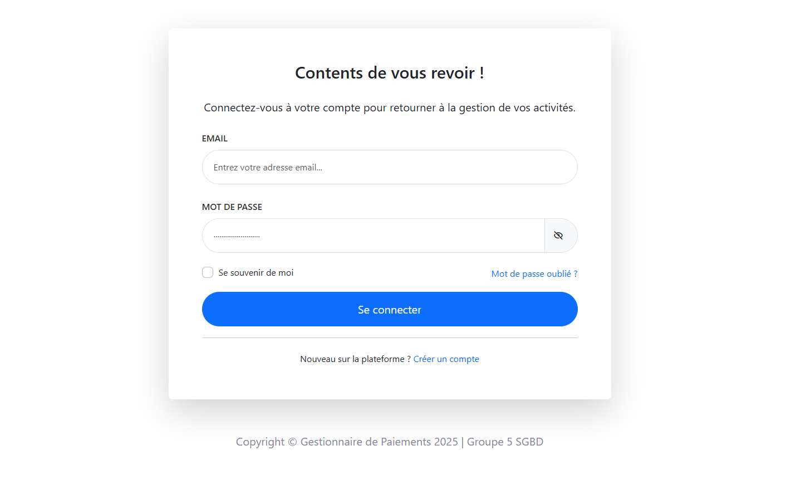

### 2. Création et gestion d’une activité

- Cliquez sur “Créer une activité”.
- Remplissez le formulaire (nom, description, période, centre, etc.).
- Validez pour enregistrer l’activité.

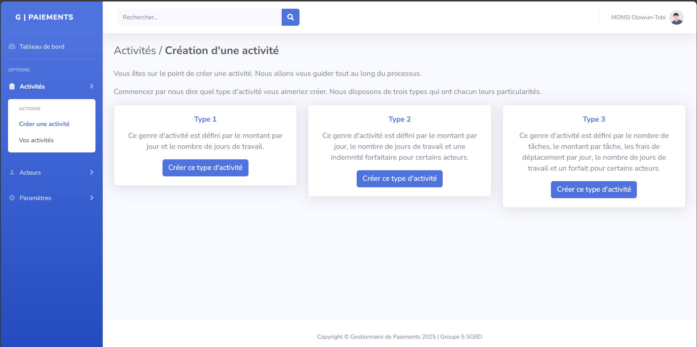

- Après avoir créé l'activité, vous pouvez voir les informations relatives à l'activité comme ci-après :

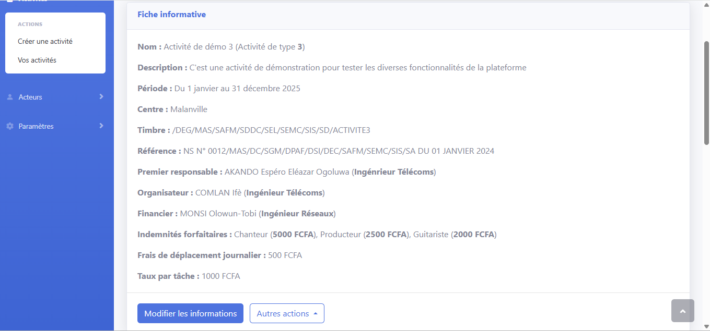

- Vous pouvez cliquer sur `Autre action` pour `Supprimer` l'activité, `Générer les documents` si des participants y sont déjà associés ou `Éditer l'en-tête des documents`.
- Vous pouvez également modifier les informations d'une activité déjà créée en cliquant sur `Modifier les informations`.
- Toutes les activités créées sont visibles en cliquant sur `Activité` puis `Vos Activités` dans la barre d'outils à gauche :

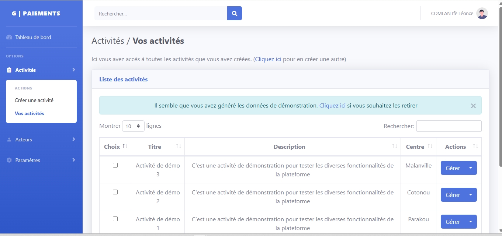

- Vous pouvez rechercher vos activités dans la barre de recherche et cliquer sur le bouton `Gérer` pour effectuer vos actions.

### 3. Création et gestion des acteurs

- Accédez à l’activité créée.
- Cliquez sur “Associer des acteurs” ou “Ajouter un participant”.
- Sélectionnez les acteurs que vous souhaitez associer à l'activité. Si vous n'avez encore créé aucun acteur, cliquez sur le bouton `Ajouter un acteur` de la page ci-après :

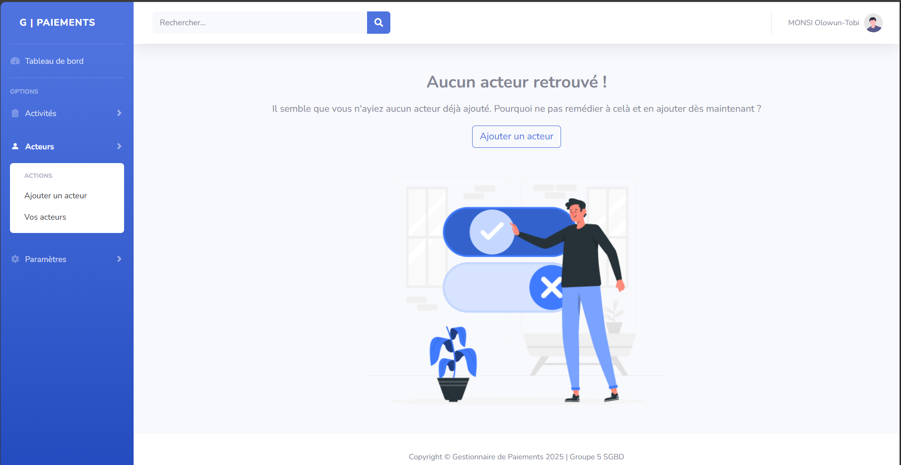

- Si vous avez déjà créé des acteurs, sélectionnez-les sur la page qui s'affiche :

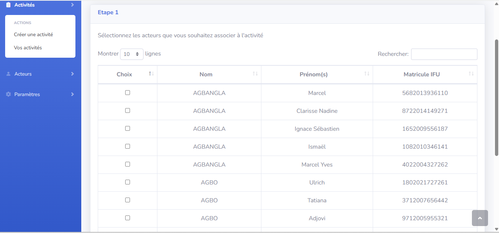

- Remplissez les informations requises (nom, titre, coordonnées bancaires, etc.).

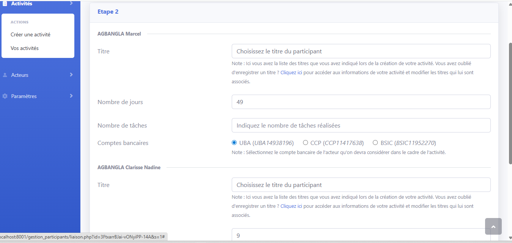

- Une fois les informations saisies, cliquez sur le bouton `Relier la liaison`.

- Vous pouvez voir les participants associés à une activité ci-dessous :

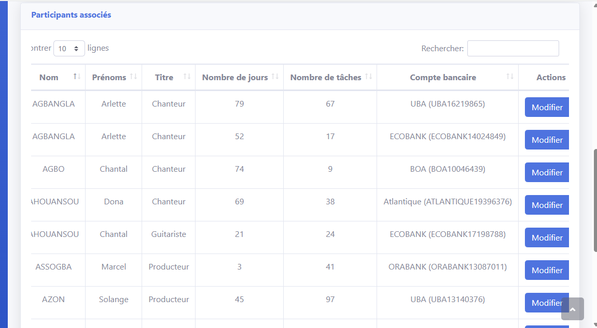

- Vous pouvez rechercher un participant en tapant son nom dans la barre de recherche en haut à droite, puis cliquer sur `Modifier` pour modifier les informations qui lient le participant à l'activité ou sur `Rompre la liaison` pour retirer le participant de l'activité.

- Lorsque vous cliquez sur le bouton `Gérer le participant`, la page ci-après s'affiche :

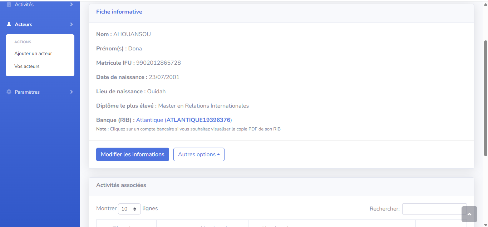

- Cliquez sur `Modifier les informations` pour modifier les informations personnelles d'un participant ou sur `Autres actions` pour l'associer à une autre activité ou lui ajouter un compte bancaire.

### 4. Génération des documents

- Une fois que vous avez créé votre activité et ajouté des acteurs, il est temps de générer les différents documents.
- Dans la barre de navigation, cliquez sur `Activité` puis `Vos activités`.
- Choisissez votre activité ou tapez son nom dans la barre de recherche pour aller plus vite.
- Cliquez sur `Gérer`.
- Vous verrez en haut à droite un bouton `Générer document`.
- Éditez l'en-tête de votre document sur la page ci-après :

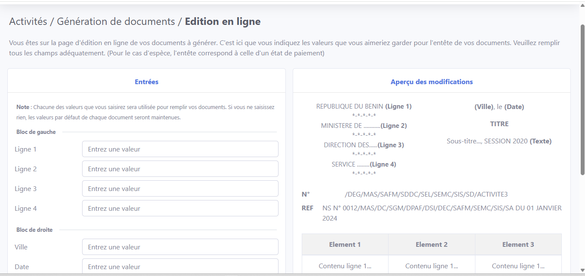

- Ensuite, choisissez les documents que vous souhaitez générer puis cliquez sur continuer.
- Vous avez la possibilité de les générer en fichier zippé ou en un seul fichier non zippé.

### 5. Gestion du compte utilisateur

- Une fois connecté, vous pouvez modifier vos informations personnelles depuis votre espace utilisateur en accédant à Paramètres dans la barre des tâches.
- Vous pouvez changer votre mot de passe, mettre à jour vos informations de contact, etc.
- Vous avez également la possibilité de désactiver votre compte.

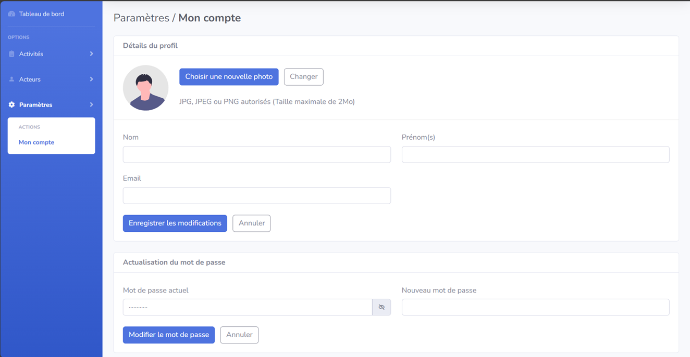

---

## 🗂️ Structure du projet

- `gestion_activites/` : gestion des activités, création, édition, génération de
  documents.
- `gestion_participants/` : gestion des participants, liaisons, informations
  bancaires.
- `includes/` : fichiers utilitaires, connexion BDD, constantes, fonctions
  communes.
- `assets/` : ressources statiques (CSS, JS, images).
- `auth/` : gestion de l’authentification.
- `pdfs_temp/` : stockage temporaire des PDF générés.
- `PHPMailer/`, `tcpdf/` : librairies tierces pour l’envoi de mails et la
  génération de PDF.

---

## 💡 Conseils & bonnes pratiques

- **Sauvegardez régulièrement la base de données.**
- **Ne partagez pas vos identifiants de connexion.**
- **Vérifiez les droits d’écriture sur les dossiers d’upload et de génération de
  PDF.**
- **Pour toute question, consultez la documentation ou contactez
  l’administrateur.**

---

## 👨‍💻 Auteurs

- Ifè Léonce Sokey Amour COMLAN — ifeleoncecomlan@gmail.com
- Olowun-Tobi MONSI — onellemonsiotojisca@gmail.com
- Espéro AKANDO — esperoakando@gmail.com
- Judicael GBAGUIDI — gbaguidijudicael520@gmail.com

_N’hésitez pas à nous contacter pour toute question ou suggestion !_

---

## 🙋‍♂️ Support

Pour toute question ou suggestion, ouvrez une issue sur le dépôt GitHub ou
contactez l’équipe de développement.
